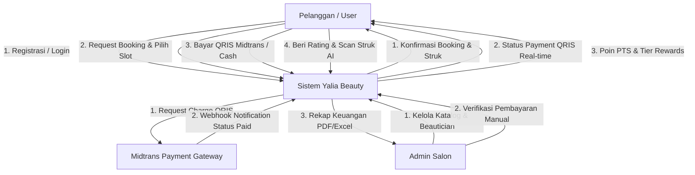
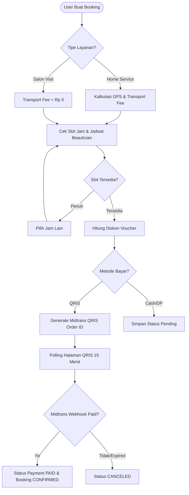

# 🌸 Yalia Beauty — Beauty & Wellness Salon Booking Platform

<p align="center">
  
</p>

<p align="center">
  <b>Glow Up Your Beauty</b> — Platform Reservasi Layanan Salon & Home Service Terintegrasi dengan Midtrans QRIS, Sistem Loyalty Tier VIP, dan AI Receipt Tracker.
</p>

---

## 📌 Daftar Isi
1. [Tentang Yalia Beauty](#-tentang-yalia-beauty)
2. [Teknologi & Stack](#-teknologi--stack)
3. [Analisis Struktur Database & Migration](#-analisis-struktur-database--migration)
4. [Diagram Konseptual Basis Data (CDM, PDM, ERD)](#-diagram-konseptual-basis-data-cdm-pdm-erd)
5. [Data Flow Diagram (DFD Level 0 & Level 1)](#-data-flow-diagram-dfd-level-0--level-1)
6. [Flowchart Sistem & Operasional Manual](#-flowchart-sistem--operasional-manual)
7. [Alur Pengguna End-to-End (Login s/d Logout)](#-alur-pengguna-end-to-end-login-sd-logout)
8. [Panduan Fitur Utama & Cara Penggunaan](#-panduan-fitur-utama--cara-penggunaan)
9. [Instalasi & Cara Menjalankan Project](#-instalasi--cara-menjalankan-project)

---

## 🌺 Tentang Yalia Beauty

**Yalia Beauty** adalah platform web reservasi salon dan layanan kecantikan panggilan (*home service*) modern yang didesain khusus untuk pasar Indonesia. Platform ini memberikan pengalaman booking tanpa hambatan (*frictionless*) dengan perhitungan jam slot real-time, pencarian lokasi GPS otomatis, integrasi pembayaran otomatis QRIS via Midtrans Core API, sistem pengingat otomatis (H-24, H-1, M-30), serta program poin reward dan tier keanggotaan VIP.

---

## 🛠 Teknologi & Stack

- **Backend Framework**: Laravel 13 (PHP 8.3)
- **Application Server**: Laravel Octane v2
- **Auth & Starter Kit**: Laravel Breeze v2 & Laravel Socialite v5 (Google OAuth)
- **Frontend Stack**: Tailwind CSS v3, Alpine.js v3, Blade Templates, React v19
- **Payment Gateway**: Midtrans Core API (QRIS, Bank Transfer, e-Wallet)
- **AI Feature**: LLM Vision API untuk Scanner Struk Pengeluaran Kecantikan
- **Database**: MySQL 8.0+

---

## 🗄 Analisis Struktur Database & Migration

Sistem Yalia Beauty memiliki **15 Tabel Utama** yang saling terelasi secara konsisten:

| Nama Tabel | Peran & Deskripsi Utama | Migration File |
| :--- | :--- | :--- |
| `users` | Data akun user/admin, level membership, poin, tier points, total transaksi, koordinat GPS. | `0001_01_01_000000_create_users_table.php` |
| `beauticians` | Data kapster/terapis kecantikan, bio, foto, status aktif, total booking. | `2026_07_29_012141_create_beauticians_table.php` |
| `beauticians_schedules` | Hari & jam kerja beautician (`day_of_week`, `start_time`, `end_time`). | `2026_07_29_013211_create_beauticians_schedules_table.php` |
| `categories` | Master kategori treatment (Facial, Hair, Nail, Makeup, Body Care). | `2026_07_29_013033_create_categories_table.php` |
| `treatments` | Katalog layanan, harga, durasi menit, poin PTS, rating, badge. | `2026_07_29_013109_create_treatments_table.php` |
| `bookings` | Core transaksi booking, lokasi GPS, transport fee, tipe bayar, status, Midtrans order ID, `version`. | `2026_07_29_013120_create_bookings_table.php` |
| `booking_treatments` | Pivot M:N booking & treatment dengan snapshot harga dan quantity. | `2026_07_29_013302_create_booking_treatments_table.php` |
| `vouchers` | Master kode voucher diskon dan penukaran poin event. | `2026_07_29_013239_create_vouchers_table.php` |
| `user_vouchers` | Rekam klaim voucher pelanggan (`unique(user_id, voucher_id)`). | `2026_07_29_013345_create_user_vouchers_table.php` |
| `transactions` | Pembukuan pemasukan dan pengeluaran keuangan salon. | `2026_07_29_013316_create_transactions_table.php` |
| `reviews` | Rating 1-5, komentar, foto hasil perawatan, dan balasan admin per booking. | `2026_07_29_013334_create_reviews_table.php` |
| `expenses` | Header pencatatan pengeluaran pelanggan / operasional. | `2026_08_22_060001_create_expenses_table.php` |
| `expense_items` | Rincian item belanja hasil scan struk AI. | `2026_08_22_060002_create_expense_items_table.php` |
| `expense_categories` | Master kategori pengeluaran belanja. | `2026_07_29_013408_create_expense_categories_table.php` |
| `notifications` | Sistem notifikasi internal Laravel. | `2026_07_29_025320_create_notifications_table.php` |

---

## 📐 Diagram Konseptual Basis Data (CDM, PDM, ERD)

### ERD (Entity Relationship Diagram)

```mermaid
erDiagram
    USERS ||--o{ BOOKINGS : "places"
    USERS ||--o{ USER_VOUCHERS : "claims"
    USERS ||--o{ REVIEWS : "writes"
    USERS ||--o{ EXPENSES : "records"
    BEAUTICIANS ||--o{ BOOKINGS : "assigned to"
    BEAUTICIANS ||--o{ BEAUTICIANS_SCHEDULES : "has"
    BEAUTICIANS ||--o{ REVIEWS : "receives"
    CATEGORIES ||--o{ TREATMENTS : "contains"
    TREATMENTS ||--o{ BOOKING_TREATMENTS : "included in"
    BOOKINGS ||--o{ BOOKING_TREATMENTS : "has items"
    BOOKINGS ||--o1 REVIEWS : "has"
    BOOKINGS ||--o1 TRANSACTIONS : "generates"
    VOUCHERS ||--o{ USER_VOUCHERS : "issued as"
    EXPENSES ||--o{ EXPENSE_ITEMS : "contains"
```

---

## 📊 Data Flow Diagram (DFD Level 0 & Level 1)

### Context Diagram (DFD Level 0)



---

## 🔄 Flowchart Sistem & Operasional Manual

### Flowchart Sistem (Validasi Booking & QRIS)



---

## 🔄 Alur Pengguna End-to-End (Login s/d Logout)

1. **Login / Register (`/login`, `/register`, `/auth/google`)**:
   - Masuk dengan akun email/password atau login instan dengan Google.
2. **Dashboard & Check-in Harian (`/dashboard`)**:
   - Klaim poin harian (+10 PTS) dan lihat banner promo terbaru.
3. **Katalog Perawatan (`/dashboard/treatments`)**:
   - Telusuri layanan salon, filter kategori, baca ulasan dan durasi perawatan.
4. **Wizard Reservasi (`/dashboard/booking/buat`)**:
   - Tentukan treatment & kuantitas.
   - Pilih *Salon Visit* atau *Home Service* (otomatis mengambil koordinat GPS).
   - Pilih tanggal, jam slot, dan Beautician pilihan (atau *Auto-Assign*).
   - Gunakan voucher diskon, pilih *Full Payment* / *DP*, dan metode pembayaran.
5. **Pembayaran QRIS (`/dashboard/booking/{id}/pembayaran`)**:
   - Tampilkan QRIS Midtrans dengan countdown 15 menit. Polling otomatis mengupdate halaman setelah bayar.
6. **Pelaksanaan Perawatan (`/dashboard/booking/{id}`)**:
   - Terima pengingat H-24, H-1, M-30. Beautician/admin mengunggah foto dokumentasi perawatan (`photo_assign`).
7. **Poin & Penukaran Voucher (`/dashboard/vouchers`)**:
   - Dapatkan poin PTS otomatis. Naikkan tier membership (Regular $\rightarrow$ Silver $\rightarrow$ Gold $\rightarrow$ Platinum) dan tukar poin dengan voucher diskon.
8. **Tracker Struk AI (`/expenses`)**:
   - Pindai struk belanja produk kecantikan untuk ekstraksi item otomatis berbasis AI.
9. **Logout (`/logout`)**:
   - Keluar dari sesi aplikasi secara aman.

---

## 💻 Instalasi & Cara Menjalankan Project

### Requirements:
- PHP >= 8.3
- Composer
- Node.js & NPM
- MySQL Database

### Steps:
```bash
# 1. Clone & Install PHP Dependencies
composer install

# 2. Install Node Dependencies & Build Assets
npm install
npm run build

# 3. Environment Configuration
cp .env.example .env
php artisan key:generate

# 4. Run Migration & Seeder
php artisan migrate --seed

# 5. Run Server
composer run dev
```
