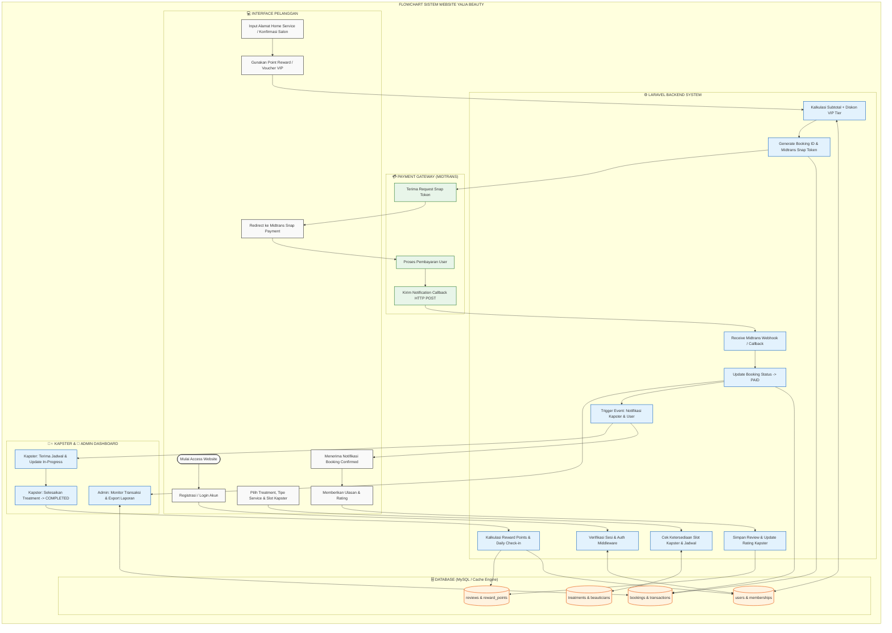
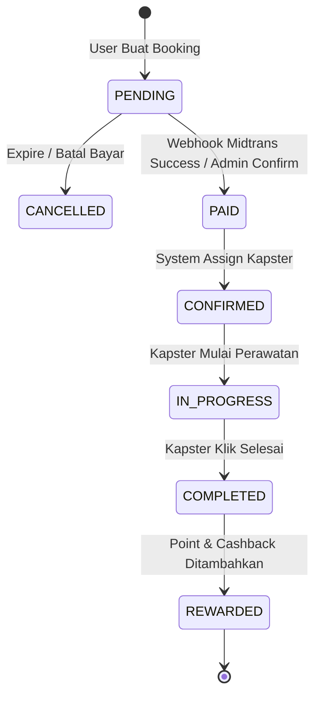

# DOKUMENTASI SISTEM & FLOWCHART SISTEM END-TO-END SALON YALIA BEAUTY

Dokumen ini menjelaskan alur kerja teknis sistem informasi website **Salon Yalia Beauty** berbasis Laravel secara end-to-end, mencakup logika sistem, pengolahan database, integrasi payment gateway Midtrans, manajemen poin & VIP, serta modul dashboard Admin/Kapster.

---

## 1. FLOWCHART SISTEM END-TO-END (MERMAID SYSTEM FLOWCHART)

Berikut adalah **Flowchart Sistem** yang menggambarkan aliran data otomatis antara pengguna, server Laravel Octane, Database, Midtrans Payment Gateway, dan Dashboard Pengguna.

---

## 2. STATE MACHINE STATUS BOOKING & TRANSAKSI

Sistem mengontrol status pesanan secara ketat dengan status berikut:

---

## 3. ALUR LOGIKA MODUL UTAMA WEBSITE

### A. Modul Autentikasi & VIP Membership
1. **Registrasi/Login**: Sistem memeriksa email & password terenkripsi (`Bcrypt`).
2. **Kalkulasi VIP Tier (`app/Support/Membership.php`)**:
   - **Bronze**: Pendaftaran awal.
   - **Silver**: Total transaksi $\ge Rp 500.000$ (Diskon 5%, Metallic Silver UI).
   - **Gold**: Total transaksi $\ge Rp 1.500.000$ (Diskon 10%, Gold Glow UI).
   - **Platinum**: Total transaksi $\ge Rp 3.500.000$ (Diskon 15%, Premium Dark UI).

### B. Modul Pemesanan (Booking Engine)
1. **Validasi Slot**: Sistem mengecek tabel `bookings` untuk memastikan `beautician_id` tidak bentrok di jam dan tanggal yang sama.
2. **Kalkulasi Biaya**:
   $$\text{Total} = \text{Harga Treatment} - \text{Diskon VIP} - \text{Poin Reward Terpakai} + \text{Biaya Transport (jika Home Service)}$$
3. **Penyimpanan Database**: Menyimpan record di tabel `bookings` (status `pending`) dan `transactions`.

### C. Modul Payment Gateway (Midtrans Integration)
1. Backend memanggil Midtrans Snap API menggunakan ServerKey untuk mendapatkan `snap_token`.
2. Setelah pelanggan membayar, Midtrans mengirimkan HTTP POST Notification (Webhook) ke endpoint `/api/midtrans-callback`.
3. Signature Key diverifikasi:
   $$\text{SHA512}(\text{order\_id} + \text{status\_code} + \text{gross\_amount} + \text{ServerKey})$$
4. Jika valid, status transaksi diubah dari `pending` menjadi `paid`.

### D. Modul Eksekusi Kapster & Reward System
1. **Pekerjaan Kapster**: Kapster menerima notifikasi di dashboard mereka, mengubah status menjadi `in_progress` saat mulai melayani, dan `completed` setelah selesai.
2. **Poin & Check-in**:
   - Setelah status `completed`, poin otomatis ditambahkan ke `users.points`.
   - Modul Daily Check-in memberikan poin tambahan harian (Streak Poin).

### E. Modul Admin & Caching (`Cache::remember`)
1. Dashboard Admin menggunakan Laravel Cache untuk mempercepat query statistik harian (`topTreatments`, `totalRevenue`, `activeBeauticians`).
2. Admin dapat mengunduh laporan keuangan dan performa kapster.

---

## 4. STRUKTUR DIKTATOR DATABASE (ENTITY RELATIONSHIPS)

- **`users`**: `id`, `name`, `email`, `role` (customer/admin/superadmin), `points`, `total_spent`.
- **`beauticians`**: `id`, `user_id`, `name`, `rating`, `status_active`.
- **`treatments`**: `id`, `category_id`, `name`, `price`, `duration_minutes`, `type` (salon/home_service/both).
- **`bookings`**: `id`, `booking_code`, `user_id`, `beautician_id`, `treatment_id`, `booking_date`, `time_slot`, `service_type`, `status`.
- **`transactions`**: `id`, `booking_id`, `payment_gateway`, `snap_token`, `payment_status`, `gross_amount`.
- **`reviews`**: `id`, `booking_id`, `user_id`, `beautician_id`, `rating`, `comment`.

---

Dokumen ini menjadi acuan teknis resmi alur sistem website **Salon Yalia Beauty**.
